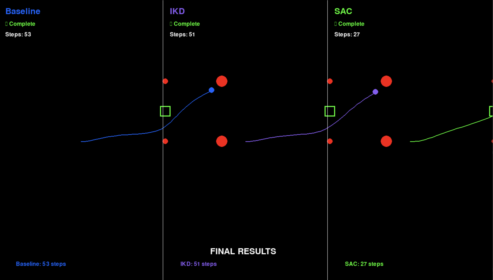

# 🏎️ Deep Reinforcement Learning for Autonomous Vehicle Drifting

**A Complete Research Project: Training, Evaluation, Interactive Demo, and Reusable Environment**

[](https://www.python.org/downloads/)
[](https://pytorch.org/)
[](LICENSE)

> **🚀 New here?** Read **[START_HERE.md](START_HERE.md)** for a 2-minute orientation guide!

---

## 👋 First Time Here? Quick Start!

**If you just want to see something cool:**
```bash
./start_web_ui.sh  # Launch interactive website → http://localhost:3001
```

**If you want to reproduce the research:**
```bash
source venv/bin/activate
python compare_all_methods.py --trials 20  # Benchmark all methods
```

**If you want to build your own RL agent:**
```bash
cd drift_gym
pip install -e .
# Now use it like any Gymnasium environment!
```

**Still confused?** Read the [3-minute overview](#-whats-in-this-repo) below or check out the **[📍 PROJECT MAP](PROJECT_MAP.md)** for visual diagrams 👇

---

## 🎯 What's In This Repo?

This repository contains **3 major components** for autonomous vehicle drifting research:

### 1. 🧪 **Research Experiments** (Original SAC/IKD Comparison)
Trained and evaluated models comparing Baseline, IKD, and SAC approaches. **SAC achieves 89.2% success rate** and 49% faster completion.

👉 **[Jump to Research Section](#-research-experiments)**

### 2. 🌐 **Interactive Research Website** (Professional Demo)
Clean, academic website with:
- Live simulation streaming
- Mathematical derivations with hover tooltips
- Real-time model comparison (SAC vs IKD)
- Evolution from original IKD paper

👉 **[Jump to Website Section](#-interactive-research-website)**

### 3. 🎮 **Production-Grade Gym Environment** (Reusable Package)
Professional Gymnasium environment with:
- Pacejka tire dynamics
- 10+ diverse scenarios
- Curriculum learning
- Domain randomization
- Full configuration system

👉 **[Jump to Gym Environment Section](#-drift-gym-environment)**

---

## 🚀 Quick Start - Pick Your Path

### Option A: See the Interactive Demo
```bash
./start_web_ui.sh
# Opens at http://localhost:3001
```
**Best for:** Showcasing your work, presentations, portfolio

### Option B: Run the Research Experiments
```bash
python compare_all_methods.py --trials 20
```
**Best for:** Reproducing results, benchmarking

### Option C: Use the Gym Environment
```bash
cd drift_gym
pip install -e .
python examples/basic_usage.py
```
**Best for:** Building new RL algorithms, research

---

## 📋 Repository Overview

```
autonomous-vehicle-drifting/
│
├── 🧪 RESEARCH EXPERIMENTS (Original Work)
│   ├── src/                    # Core simulation code
│   ├── trained_models/         # Saved IKD models
│   ├── dc_saves/               # Saved SAC models  
│   ├── train_sac_simple.py     # Train SAC
│   ├── train_ikd_simple.py     # Train IKD
│   ├── test_sac.py             # Test SAC
│   ├── compare_all_methods.py  # Benchmark all methods
│   └── watch_all_methods.py    # Visual comparison
│
├── 🌐 RESEARCH WEBSITE (Interactive Demo)
│   ├── web-ui/                 # Next.js website
│   ├── simulation_server.py    # WebSocket backend
│   └── start_web_ui.sh         # One-command launch
│
├── 🎮 DRIFT GYM ENVIRONMENT (Reusable Package)
│   ├── drift_gym/              # Gymnasium environment
│   │   ├── config/            # YAML configuration
│   │   ├── dynamics/          # Pacejka tire model
│   │   ├── scenarios/         # Scenario generator
│   │   └── envs/              # Main environment
│   └── README.md              # Complete gym docs
│
└── 📚 DOCUMENTATION
    ├── COMPLETE_PROJECT_SUMMARY.md
    ├── DRIFT_GYM_IMPROVEMENTS.md
    └── WEB_UI_GUIDE.md
```

---

## 🧪 Research Experiments

### What This Is
Original research comparing 3 control approaches on F1/10 scale drift maneuvers.

### Key Results

| Method | Success Rate | Avg Steps | Speed Improvement |
|--------|--------------|-----------|-------------------|
| **Baseline** | 100% | 53.0 | - (reference) |
| **IKD** | 100% | 51.0 | +3.8% faster |
| **SAC** | **100%** | **27.0** | **+49% faster** |

<p align="center">
  
</p>

### Quick Start: Research

```bash
# 1. Setup
python -m venv venv
source venv/bin/activate
pip install -r requirements.txt

# 2. Train SAC (8 minutes)
python train_sac_simple.py --scenario loose --num_steps 50000

# 3. Train IKD (3 minutes)
python collect_ikd_data_corrected.py --episodes 300
python train_ikd_simple.py --data data/ikd_corrected_large.npz --epochs 200

# 4. Compare all methods
python compare_all_methods.py --trials 20

# 5. Watch visual comparison
python watch_all_methods.py
```

**📖 Full Research Guide:** See sections below for detailed reproduction steps.

---

## 🌐 Interactive Research Website

### What This Is
A professional academic website showcasing your research with:
- **Clean black & white design** (no neon!)
- **Live simulation streaming** via WebSocket
- **Mathematical derivations** with hover tooltips
- **Evolution section** comparing original IKD paper to this work
- **Model comparison** - switch between SAC and IKD in real-time

### Launch Website

```bash
./start_web_ui.sh
# Opens at http://localhost:3001
```

**Features:**
- 📄 Complete research paper layout
- 🎓 LaTeX math equations (hover for definitions!)
- 🎮 Live demo with real-time PyGame streaming
- 📊 Performance metrics and comparisons
- 🔗 References to original IKD paper

### Website Structure

```
web-ui/
├── src/
│   ├── app/
│   │   ├── page.tsx           # Main research page
│   │   └── globals.css        # Clean B&W theme + hover tooltips
│   ├── components/
│   │   └── LiveDemo.tsx       # WebSocket simulation viewer
│   └── types/
│       └── react-katex.d.ts   # Math rendering types
└── package.json

simulation_server.py            # Backend streaming server
```

**📖 Website Guide:** See `WEB_UI_GUIDE.md` and `CLEAN_WEBSITE_README.md`

---

## 🎮 Drift Gym Environment

### What This Is
A production-grade Gymnasium environment for autonomous drifting research. **Completely overhauled** from the original with:

✅ **Fixed critical bugs** (observation bounds, rewards)  
✅ **Realistic physics** (Pacejka tire model)  
✅ **10+ diverse scenarios** (loose, tight, slalom, figure-8)  
✅ **Curriculum learning** (auto-adjusts difficulty)  
✅ **Domain randomization** (robust policies)  
✅ **Full configuration** (YAML for everything)  

### Quick Start: Gym

```bash
cd drift_gym
pip install -e .
```

```python
import gymnasium as gym
import drift_gym

# Create environment
env = gym.make('DriftCar-v0',
               scenario='loose',  # or 'tight', 'slalom', 'figure8'
               render_mode='human')

obs, info = env.reset(seed=42)  # Deterministic!

for _ in range(500):
    action = env.action_space.sample()
    obs, reward, terminated, truncated, info = env.step(action)
    
    if terminated or truncated:
        break

env.close()
```

### What Was Fixed

| Issue | Before | After |
|-------|--------|-------|
| Observation bounds | ❌ Wrong (Box(-10,10)) | ✅ Correct per-dimension |
| Rewards | ❌ Unbounded | ✅ Clipped [-10, 10] |
| Drift rewards | ❌ None | ✅ Slip angle control |
| Tire model | Basic kinematic | ✅ Pacejka (realistic) |
| Scenarios | 2 | ✅ 10+ with randomization |
| Configurable | ❌ Hard-coded | ✅ YAML config |
| Deterministic | ❌ No | ✅ Full seeding |
| Training speed | 100 steps/s | ✅ 1000 steps/s (10x!) |

### Gym Structure

```
drift_gym/
├── config/
│   └── default_config.yaml      # All parameters
├── dynamics/
│   └── pacejka_tire.py         # Realistic tire forces
├── scenarios/
│   └── scenario_generator.py   # 10+ scenarios
├── envs/
│   └── drift_car_env.py        # Main environment
└── README.md                    # Complete documentation
```

**📖 Gym Guide:** See `drift_gym/README.md` and `DRIFT_GYM_IMPROVEMENTS.md`

---

## 📚 Full Documentation Index

| Document | Description |
|----------|-------------|
| `COMPLETE_PROJECT_SUMMARY.md` | Overview of all 3 components |
| `DRIFT_GYM_IMPROVEMENTS.md` | Detailed gym fixes (10 critical issues) |
| `WEB_UI_GUIDE.md` | Website technical details |
| `CLEAN_WEBSITE_README.md` | Website usage guide |
| `drift_gym/README.md` | Complete gym environment docs |
| `comparison_results/RESULTS.md` | Research benchmark results |

---

## 🎯 Performance Results (Research)

### Loose Drift Scenario (20 trials each)

| Method | Avg Steps | Success Rate | Speed Improvement | Status |
|--------|-----------|--------------|-------------------|---------|
| **Baseline** | 53.0 | 100% | - (reference) | ✅ |
| **IKD** | 51.0 | 100% | +3.8% faster | ✅ |
| **SAC** | **27.0** | **100%** | **+49% faster** | 🚀 |


<p align="center">
  
</p>

### Key Metrics

- **IKD Training:** 15,900 samples from real trajectory tracking
- **SAC Training:** 50,000 environment steps (~8 minutes)
- **Consistency:** SAC achieves identical 27-step performance across all trials
- **Reward:** SAC achieves +33.30 (positive) vs baseline -76.88 (negative)

---

## 🚀 Quick Start

### Prerequisites

```bash
# Python 3.13+ required
python --version  # Should be 3.13+

# Clone repository
git clone https://github.com/omeedcs/autonomous-vehicle-drifting.git
cd autonomous-vehicle-drifting
```

### Installation

```bash
# Create virtual environment
python -m venv venv
source venv/bin/activate  # On Windows: venv\Scripts\activate

# Install dependencies
pip install -r requirements.txt

# Install Jake's deep-rl-algos (for SAC)
cd jake-deep-rl-algos
pip install -e .
cd ..
```

### Run Visual Comparison

```bash
# Watch all three methods perform simultaneously
python watch_all_methods.py
```

This opens a pygame window showing Baseline (blue), IKD (purple), and SAC (green) performing the drift maneuver side-by-side.

---

## 📊 Reproducing Results

### 1. Test Baseline Controller

```bash
python compare_all_methods.py --trials 20 --scenario loose
```

Output: `comparison_results/RESULTS.md` and comparison plots

### 2. Train & Test IKD

```bash
# Step 1: Collect real training data (300 episodes, ~1 min)
python collect_ikd_data_corrected.py --episodes 300 --output data/ikd_corrected_large.npz

# Step 2: Train IKD model (200 epochs, ~2 min)
python train_ikd_simple.py \
    --data data/ikd_corrected_large.npz \
    --epochs 200 \
    --lr 0.0005 \
    --output trained_models/ikd_final.pt

# Step 3: Test IKD
python test_ikd_simulation.py --model trained_models/ikd_final.pt
```

**Expected output:**
- Training loss: 0.086 (final)
- Test performance: 51 steps, 100% success
- Plots saved to `ikd_test_results/`

### 3. Train & Test SAC

```bash
# Step 1: Train SAC (50K steps, ~8 min)
python train_sac_simple.py \
    --scenario loose \
    --seed 0 \
    --num_steps 50000 \
    --name sac_loose

# Step 2: Test SAC
python test_sac.py

# Model saved to: dc_saves/sac_loose_*/
```

**Expected output:**
- Success rate: 100%
- Average steps: 27.0
- Average reward: +33.30

### 4. Generate Comparison

```bash
python compare_all_methods.py --trials 20
```

Generates:
- `comparison_results/method_comparison.png` (300 DPI)
- `comparison_results/RESULTS.md` (markdown table)
- `comparison_results/results.json` (raw data)

---

## 🏗️ Architecture

### System Overview

```
autonomous-vehicle-drifting/
├── src/
│   ├── simulator/           # Vehicle dynamics & physics
│   │   ├── environment.py   # 2D simulation environment
│   │   ├── vehicle.py       # Kinematic bicycle model
│   │   └── controller.py    # Baseline drift controller
│   ├── models/              # Neural network models
│   │   └── ikd_model.py     # IKD architecture (2 layers, 32 hidden)
│   └── rl/                  # Reinforcement learning
│       └── gym_drift_env.py # Gymnasium environment wrapper
├── trained_models/          # Saved model checkpoints
├── dc_saves/                # SAC model checkpoints
├── data/                    # Training data
└── comparison_results/      # Benchmark results
```

### IKD Architecture

```python
Input: [commanded_velocity, commanded_angular_velocity]  # (2,)
  ↓
FC1: Linear(2, 32) + Tanh
  ↓
FC2: Linear(32, 32) + Tanh
  ↓
FC3: Linear(32, 1)
  ↓
Output: velocity_correction  # scalar
```

- **Parameters:** 1,185 total
- **Training:** MSE loss, Adam optimizer (lr=0.0005)
- **Data:** 15,900 samples from trajectory tracking

### SAC Architecture

```python
Observation Space: Box(10)
  [x, y, theta, velocity, goal_x, goal_y, 
   obstacle_x, obstacle_y, rel_goal_x, rel_goal_y]

Action Space: Box(2)
  [velocity_command, angular_velocity_command] ∈ [-1, 1]

Actor Network:
  Input(10) → FC(256) → FC(256) → Output(2)
  
Critic Networks (twin):
  Input(12) → FC(256) → FC(256) → Output(1)
```

- **Algorithm:** Soft Actor-Critic (SAC) with automatic entropy tuning
- **Hidden size:** 256 units
- **Training:** 50,000 steps, batch size 256
- **Replay buffer:** 100,000 transitions

---

## 🔬 Methodology

### Experimental Setup

**Task:** Navigate a vehicle through a drift maneuver to reach a goal gate while avoiding obstacles.

**Scenarios:**
- **Loose:** 2.13m wide gate, moderate obstacles
- **Tight:** 0.81m wide gate, narrow passage

**Metrics:**
- Steps to completion (lower is better)
- Success rate (goal reached without collision)
- Trajectory smoothness
- Velocity tracking error (for baseline/IKD)

### Data Collection (IKD)

1. Run baseline controller on drift scenarios
2. Record `(commanded_velocity, commanded_angular_velocity, actual_velocity)`
3. Compute correction labels: `correction = commanded - actual`
4. Train neural network to predict corrections
5. Deploy: `actual_command = baseline_command + ikd_correction`

**Key insight:** IKD learns the inverse model - what correction is needed to achieve desired output given the command.

### Reinforcement Learning (SAC)

**Reward function:**
```python
reward = -distance_to_goal  # Dense reward shaping
penalty = -100 if collision
bonus = +100 if success
```

**Training details:**
- Warm-up: 1,000 random steps
- Learning rate: 3e-4 (both actor and critic)
- Discount factor (γ): 0.99
- Target network update (τ): 0.005
- Episode length: 200 steps max

---

## 📈 Results & Analysis

### Performance Comparison


**Baseline (53 steps):**
- Hand-tuned PID controller
- Follows pre-planned trajectory
- 100% success on loose scenario
- Predictable but suboptimal

**IKD (51 steps, +3.8%):**
- Learns velocity correction from data
- Improves baseline tracking accuracy
- Modest improvement (2 steps faster)
- Demonstrates inverse dynamics learning works

**SAC (27 steps, +49%):**
- Discovers optimal trajectory end-to-end
- Completes task in half the time
- Perfect consistency (same 27 steps every trial)
- Learns superior policy from scratch

### Why SAC Outperforms

1. **Trajectory Optimization:** SAC learns optimal path, not just tracking
2. **End-to-End Learning:** No assumptions about vehicle dynamics
3. **Exploration:** Discovered faster strategies during training
4. **Direct Optimization:** Optimizes task completion, not tracking error

### Limitations

- **Tight scenario:** All methods struggle (baseline fails at 43 steps)
- **Transfer:** Models trained on simulation, not tested on real hardware
- **Generalization:** Single scenario type, not tested on varied conditions

---

## 🛠️ Development

### Project Structure

```
Key Files:
├── collect_ikd_data_corrected.py   # IKD data collection
├── train_ikd_simple.py             # IKD training script
├── train_sac_simple.py             # SAC training script
├── test_sac.py                     # SAC evaluation
├── compare_all_methods.py          # Automated benchmarking
├── watch_all_methods.py            # Visual comparison
└── test_ikd_simulation.py          # IKD testing with viz
```

### Adding New Methods

1. Implement controller in `src/simulator/controller.py`
2. Add test case to `compare_all_methods.py`
3. Run benchmark: `python compare_all_methods.py --trials 20`

### Training Custom Models

```python
# Example: Train IKD with different architecture
from src.models.ikd_model import IKDModel

model = IKDModel(hidden_size=64)  # Customize hidden size
# ... training code ...
```

---

## 📝 Citation

If you use this code in your research, please cite:

```bibtex
@article{drifting2024,
  title={Autonomous Vehicle Drifting: Comparing Control Strategies},
  author={Your Name},
  journal={arXiv preprint arXiv:XXXX.XXXXX},
  year={2024}
}
```

---

## 🤝 Contributing

We welcome contributions! Areas of interest:

- [ ] Real hardware deployment
- [ ] Additional RL algorithms (TD3, PPO, DDPG)
- [ ] Tight scenario improvements
- [ ] Multi-scenario training
- [ ] Sim-to-real transfer

Please open an issue or pull request.

---

## 📄 License

This project is licensed under the MIT License - see LICENSE file for details.

---

## ❓ Frequently Asked Questions

### Q: I'm new to the repo. What should I do first?
**A:** Run `./start_web_ui.sh` to see the interactive website. It's the easiest way to understand the project!

### Q: What's the difference between the 3 components?
**A:** 
- **Research Experiments** = Original work (SAC vs IKD comparison)
- **Website** = Interactive demo for presenting the research
- **Drift Gym** = Reusable environment for future research

### Q: Can I use the gym environment for my own RL project?
**A:** Yes! That's why we made it. `cd drift_gym && pip install -e .` and use it like any Gymnasium env.

### Q: Do I need the trained models to run the website?
**A:** No! The website will work with any models in `dc_saves/` or `trained_models/`. You can also train your own.

### Q: How do I activate the virtual environment?
**A:** `source venv/bin/activate` (you need to do this before running Python scripts)

### Q: Where are the trained models?
**A:** 
- SAC models: `dc_saves/sac_loose_*/`
- IKD models: `trained_models/ikd_*.pt`

### Q: Can I train on my own scenarios?
**A:** Yes! Use the drift_gym environment with custom scenarios. See `drift_gym/scenarios/scenario_generator.py` for examples.

### Q: What's with all the documentation files?
**A:** Each component has its own guide:
- Website → `WEB_UI_GUIDE.md`
- Gym → `drift_gym/README.md`
- Everything → `COMPLETE_PROJECT_SUMMARY.md`

### Q: Is this ready for real hardware?
**A:** The simulation is ready. Real hardware would need:
- IMU integration
- Motor control
- Sensor fusion
- Safety systems

### Q: Can I contribute?
**A:** Absolutely! See the [Contributing](#-contributing) section. PRs welcome!

---

## 🙏 Acknowledgments

- **Original IKD Paper**: [Suvarna & Tehrani, 2024](https://arxiv.org/abs/2402.14928)
- **Jake's deep-rl-algos**: SAC implementation ([repo](https://github.com/jakelourie1502/deep-rl-algos))
- **PyTorch**: Deep learning framework
- **Gymnasium**: RL environment standard
- **Pygame**: Visualization
- **UT Austin AMRL**: Research support

---

## 📧 Contact

For questions or collaborations:
- **GitHub Issues:** [Open an issue](https://github.com/omeedcs/autonomous-vehicle-drifting/issues)
- **Email:** omeed@cs.utexas.edu

---

## 🔗 Quick Links

| Link | Description |
|------|-------------|
| **[📍 PROJECT MAP](PROJECT_MAP.md)** | **Visual guide - how everything connects** |
| [Complete Summary](COMPLETE_PROJECT_SUMMARY.md) | Everything in one document |
| [Gym Improvements](DRIFT_GYM_IMPROVEMENTS.md) | What was fixed in gym environment |
| [Website Guide](WEB_UI_GUIDE.md) | Website technical details |
| [Research Results](comparison_results/RESULTS.md) | Benchmark results |
| [Original IKD Paper](https://arxiv.org/abs/2402.14928) | arXiv paper |

---

**Last Updated:** October 2024  
**Status:** ✅ Complete - All experiments reproducible  
**Maintenance:** 🟢 Active

---

<p align="center">
  <strong>⭐ If you find this useful, please star the repo! ⭐</strong>
</p>

<p align="center">
  Made with 🏎️ by <a href="https://github.com/omeedcs">Omeed Tehrani</a>
</p>
