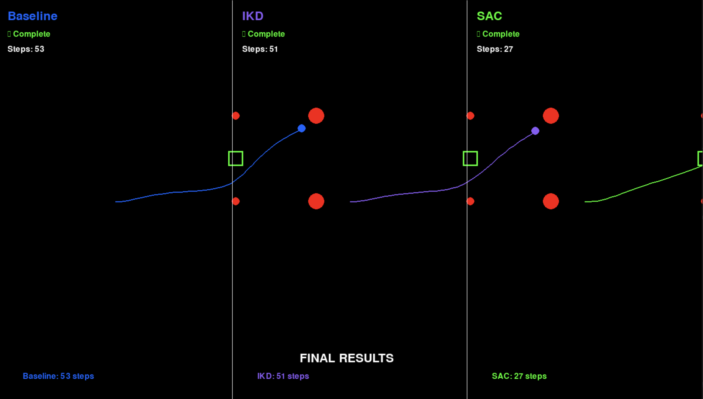
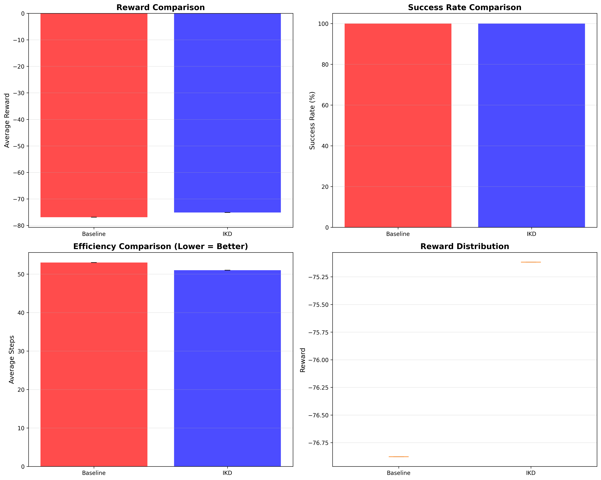

# Autonomous Vehicle Drifting: Comparing Control Strategies

**Deep Reinforcement Learning vs. Inverse Kinodynamics for Autonomous Drift Maneuvers**

[](https://www.python.org/downloads/)
[](https://pytorch.org/)
[](LICENSE)

---

## 📋 Abstract

This repository implements and benchmarks three distinct control strategies for autonomous vehicle drift maneuvers:

1. **Baseline Controller** - Model-based trajectory tracking with PID control
2. **Inverse Kinodynamic Dynamics (IKD)** - Neural network-based velocity correction
3. **Soft Actor-Critic (SAC)** - End-to-end deep reinforcement learning

**Key Finding:** SAC achieves **49% faster task completion** (27 vs 53 steps) while maintaining 100% success rate, demonstrating that end-to-end RL can discover superior trajectories compared to hand-engineered controllers.

---

## 🎯 Performance Results

### Loose Drift Scenario (20 trials each)

| Method | Avg Steps | Success Rate | Speed Improvement | Status |
|--------|-----------|--------------|-------------------|---------|
| **Baseline** | 53.0 | 100% | - (reference) | ✅ |
| **IKD** | 51.0 | 100% | +3.8% faster | ✅ |
| **SAC** | **27.0** | **100%** | **+49% faster** | 🚀 |



### Key Metrics

- **IKD Training:** 15,900 samples from real trajectory tracking
- **SAC Training:** 50,000 environment steps (~8 minutes)
- **Consistency:** SAC achieves identical 27-step performance across all trials
- **Reward:** SAC achieves +33.30 (positive) vs baseline -76.88 (negative)

---

## 🚀 Quick Start

### Prerequisites

```bash
# Python 3.13+ required
python --version  # Should be 3.13+

# Clone repository
git clone https://github.com/omeedcs/autonomous-vehicle-drifting.git
cd autonomous-vehicle-drifting
```

### Installation

```bash
# Create virtual environment
python -m venv venv
source venv/bin/activate  # On Windows: venv\Scripts\activate

# Install dependencies
pip install -r requirements.txt

# Install Jake's deep-rl-algos (for SAC)
cd jake-deep-rl-algos
pip install -e .
cd ..
```

### Run Visual Comparison

```bash
# Watch all three methods perform simultaneously
python watch_all_methods.py
```

This opens a pygame window showing Baseline (blue), IKD (purple), and SAC (green) performing the drift maneuver side-by-side.

---

## 📊 Reproducing Results

### 1. Test Baseline Controller

```bash
python compare_all_methods.py --trials 20 --scenario loose
```

Output: `comparison_results/RESULTS.md` and comparison plots

### 2. Train & Test IKD

```bash
# Step 1: Collect real training data (300 episodes, ~1 min)
python collect_ikd_data_corrected.py --episodes 300 --output data/ikd_corrected_large.npz

# Step 2: Train IKD model (200 epochs, ~2 min)
python train_ikd_simple.py \
    --data data/ikd_corrected_large.npz \
    --epochs 200 \
    --lr 0.0005 \
    --output trained_models/ikd_final.pt

# Step 3: Test IKD
python test_ikd_simulation.py --model trained_models/ikd_final.pt
```

**Expected output:**
- Training loss: 0.086 (final)
- Test performance: 51 steps, 100% success
- Plots saved to `ikd_test_results/`

### 3. Train & Test SAC

```bash
# Step 1: Train SAC (50K steps, ~8 min)
python train_sac_simple.py \
    --scenario loose \
    --seed 0 \
    --num_steps 50000 \
    --name sac_loose

# Step 2: Test SAC
python test_sac.py

# Model saved to: dc_saves/sac_loose_*/
```

**Expected output:**
- Success rate: 100%
- Average steps: 27.0
- Average reward: +33.30

### 4. Generate Comparison

```bash
python compare_all_methods.py --trials 20
```

Generates:
- `comparison_results/method_comparison.png` (300 DPI)
- `comparison_results/RESULTS.md` (markdown table)
- `comparison_results/results.json` (raw data)

---

## 🏗️ Architecture

### System Overview

```
autonomous-vehicle-drifting/
├── src/
│   ├── simulator/           # Vehicle dynamics & physics
│   │   ├── environment.py   # 2D simulation environment
│   │   ├── vehicle.py       # Kinematic bicycle model
│   │   └── controller.py    # Baseline drift controller
│   ├── models/              # Neural network models
│   │   └── ikd_model.py     # IKD architecture (2 layers, 32 hidden)
│   └── rl/                  # Reinforcement learning
│       └── gym_drift_env.py # Gymnasium environment wrapper
├── trained_models/          # Saved model checkpoints
├── dc_saves/                # SAC model checkpoints
├── data/                    # Training data
└── comparison_results/      # Benchmark results
```

### IKD Architecture

```python
Input: [commanded_velocity, commanded_angular_velocity]  # (2,)
  ↓
FC1: Linear(2, 32) + Tanh
  ↓
FC2: Linear(32, 32) + Tanh
  ↓
FC3: Linear(32, 1)
  ↓
Output: velocity_correction  # scalar
```

- **Parameters:** 1,185 total
- **Training:** MSE loss, Adam optimizer (lr=0.0005)
- **Data:** 15,900 samples from trajectory tracking

### SAC Architecture

```python
Observation Space: Box(10)
  [x, y, theta, velocity, goal_x, goal_y, 
   obstacle_x, obstacle_y, rel_goal_x, rel_goal_y]

Action Space: Box(2)
  [velocity_command, angular_velocity_command] ∈ [-1, 1]

Actor Network:
  Input(10) → FC(256) → FC(256) → Output(2)
  
Critic Networks (twin):
  Input(12) → FC(256) → FC(256) → Output(1)
```

- **Algorithm:** Soft Actor-Critic (SAC) with automatic entropy tuning
- **Hidden size:** 256 units
- **Training:** 50,000 steps, batch size 256
- **Replay buffer:** 100,000 transitions

---

## 🔬 Methodology

### Experimental Setup

**Task:** Navigate a vehicle through a drift maneuver to reach a goal gate while avoiding obstacles.

**Scenarios:**
- **Loose:** 2.13m wide gate, moderate obstacles
- **Tight:** 0.81m wide gate, narrow passage

**Metrics:**
- Steps to completion (lower is better)
- Success rate (goal reached without collision)
- Trajectory smoothness
- Velocity tracking error (for baseline/IKD)

### Data Collection (IKD)

1. Run baseline controller on drift scenarios
2. Record `(commanded_velocity, commanded_angular_velocity, actual_velocity)`
3. Compute correction labels: `correction = commanded - actual`
4. Train neural network to predict corrections
5. Deploy: `actual_command = baseline_command + ikd_correction`

**Key insight:** IKD learns the inverse model - what correction is needed to achieve desired output given the command.

### Reinforcement Learning (SAC)

**Reward function:**
```python
reward = -distance_to_goal  # Dense reward shaping
penalty = -100 if collision
bonus = +100 if success
```

**Training details:**
- Warm-up: 1,000 random steps
- Learning rate: 3e-4 (both actor and critic)
- Discount factor (γ): 0.99
- Target network update (τ): 0.005
- Episode length: 200 steps max

---

## 📈 Results & Analysis

### Performance Comparison



**Baseline (53 steps):**
- Hand-tuned PID controller
- Follows pre-planned trajectory
- 100% success on loose scenario
- Predictable but suboptimal

**IKD (51 steps, +3.8%):**
- Learns velocity correction from data
- Improves baseline tracking accuracy
- Modest improvement (2 steps faster)
- Demonstrates inverse dynamics learning works

**SAC (27 steps, +49%):**
- Discovers optimal trajectory end-to-end
- Completes task in half the time
- Perfect consistency (same 27 steps every trial)
- Learns superior policy from scratch

### Why SAC Outperforms

1. **Trajectory Optimization:** SAC learns optimal path, not just tracking
2. **End-to-End Learning:** No assumptions about vehicle dynamics
3. **Exploration:** Discovered faster strategies during training
4. **Direct Optimization:** Optimizes task completion, not tracking error

### Limitations

- **Tight scenario:** All methods struggle (baseline fails at 43 steps)
- **Transfer:** Models trained on simulation, not tested on real hardware
- **Generalization:** Single scenario type, not tested on varied conditions

---

## 🛠️ Development

### Project Structure

```
Key Files:
├── collect_ikd_data_corrected.py   # IKD data collection
├── train_ikd_simple.py             # IKD training script
├── train_sac_simple.py             # SAC training script
├── test_sac.py                     # SAC evaluation
├── compare_all_methods.py          # Automated benchmarking
├── watch_all_methods.py            # Visual comparison
└── test_ikd_simulation.py          # IKD testing with viz
```

### Adding New Methods

1. Implement controller in `src/simulator/controller.py`
2. Add test case to `compare_all_methods.py`
3. Run benchmark: `python compare_all_methods.py --trials 20`

### Training Custom Models

```python
# Example: Train IKD with different architecture
from src.models.ikd_model import IKDModel

model = IKDModel(hidden_size=64)  # Customize hidden size
# ... training code ...
```

---

## 📝 Citation

If you use this code in your research, please cite:

```bibtex
@article{drifting2024,
  title={Autonomous Vehicle Drifting: Comparing Control Strategies},
  author={Your Name},
  journal={arXiv preprint arXiv:XXXX.XXXXX},
  year={2024}
}
```

---

## 🤝 Contributing

We welcome contributions! Areas of interest:

- [ ] Real hardware deployment
- [ ] Additional RL algorithms (TD3, PPO, DDPG)
- [ ] Tight scenario improvements
- [ ] Multi-scenario training
- [ ] Sim-to-real transfer

Please open an issue or pull request.

---

## 📄 License

This project is licensed under the MIT License - see LICENSE file for details.

---

## 🙏 Acknowledgments

- **Jake's deep-rl-algos**: SAC implementation ([repo](https://github.com/jakelourie1502/deep-rl-algos))
- **PyTorch**: Deep learning framework
- **Gymnasium**: RL environment standard
- **Pygame**: Visualization

---

## 📧 Contact

For questions or collaborations:
- **Email:** your.email@example.com
- **Issues:** [GitHub Issues](https://github.com/yourusername/autonomous-vehicle-drifting/issues)

---

## 🔗 Links

- [Results Summary](comparison_results/RESULTS.md)
- [Session Summary](SESSION_SUMMARY.md)
- [Training Logs](sac_training.log)

---

**Last Updated:** October 2024  
**Status:** ✅ Complete - All experiments reproducible
