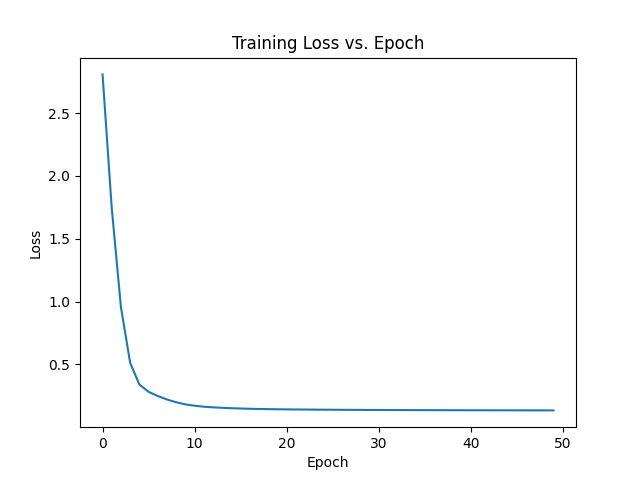

# Learning Inverse Kinodynamics for Autonomous Vehicle Drifting

[](https://arxiv.org/abs/2402.14928)
[](https://creativecommons.org/licenses/by/4.0/)
[](https://www.python.org/downloads/)
[](https://pytorch.org/)

**Official Implementation** | [Paper](https://arxiv.org/abs/2402.14928) | [Getting Started](docs/GETTING_STARTED.md) | [Reproduce Results](docs/REPRODUCING_PAPER.md)

A research-grade PyTorch implementation of Inverse Kinodynamic Learning for autonomous vehicle drifting on F1/10 scale vehicles. This repository provides a complete framework for training, evaluating, and deploying IKD models with comprehensive experiment tracking and reproducibility tools.

<p align="center">
  
</p>

## 🎯 Overview

This work demonstrates that a **simple neural network** can learn inverse kinodynamics for autonomous drifting, enabling vehicles to:
- ✅ Correct commanded trajectories in real-time
- ✅ Navigate circular paths with <2.5% error
- ✅ Tighten loose drifts with 100% success rate (CCW)
- ⚠️ Handle tight trajectories (ongoing research area)

### Key Contributions

1. **Data-Driven Approach**: Learn vehicle dynamics from IMU + joystick data
2. **Simple & Effective**: 2-layer network with 32 hidden units achieves strong results
3. **Comprehensive Evaluation**: Circle navigation, loose drifts, tight drifts
4. **Open Source**: Complete codebase with experiment tracking and reproducibility tools

### Research Findings

- 📊 **Data quality** is more important than model complexity
- 🔄 **Curvature diversity** in training data is essential
- ⚡ **Fast convergence**: 10-20 epochs typically sufficient
- 🎯 **Works best** on medium-to-loose trajectories

## 🚀 Quick Start

### Installation

```bash
# Clone the repository
git clone https://github.com/msuv08/autonomous-vehicle-drifting.git
cd autonomous-vehicle-drifting

# Install package
pip install -e .

# Or with development tools
pip install -e ".[dev]"
```

### Train a Model (5 minutes)

```bash
# Train with default configuration
python train.py

# Or with custom config
python train.py --config configs/loose_drifting.yaml --experiment-name my_experiment
```

### Evaluate Performance

```bash
# Evaluate on all test datasets
python evaluate.py \
  --checkpoint experiments/ikd_baseline/checkpoints/best_model.pt \
  --plot-results

# Run comprehensive benchmarks
python scripts/run_benchmarks.py
```

### Run Tests

```bash
pytest tests/
```

See **[Getting Started Guide](docs/GETTING_STARTED.md)** for detailed instructions.

## 📁 Project Structure

```
autonomous-vehicle-drifting/
├── configs/                    # Configuration files (YAML)
│   ├── default.yaml           # Default training config
│   ├── loose_drifting.yaml    # Loose drift experiments
│   ├── tight_drifting.yaml    # Tight drift experiments
│   └── circle_navigation.yaml # Circle test config
├── src/
│   ├── models/                # Neural network models
│   │   ├── ikd_model.py       # IKD architecture
│   │   ├── trainer.py         # Training loop with tracking
│   │   └── ...
│   ├── data_processing/       # Data pipeline
│   │   ├── validators.py      # Data quality checks
│   │   ├── align.py          # IMU-joystick alignment
│   │   └── ...
│   ├── evaluation/           # Metrics and evaluation
│   │   └── metrics.py        # IKD-specific metrics
│   ├── visualization/        # Plotting utilities
│   │   └── plot_results.py   # Result visualization
│   └── utils/               # Utilities
│       ├── config.py        # Config management
│       └── logger.py        # Experiment logging
├── tests/                   # Unit tests
├── docs/                    # Documentation
│   ├── GETTING_STARTED.md  # Tutorial
│   └── REPRODUCING_PAPER.md # Reproduction guide
├── scripts/                # Helper scripts
│   └── run_benchmarks.py  # Benchmark suite
├── train.py               # Main training script
├── evaluate.py            # Evaluation script
└── setup.py              # Package installation

```

## 🎓 Usage

### Training

**Basic training:**
```bash
python train.py
```

**Advanced options:**
```bash
python train.py \
  --config configs/loose_drifting.yaml \
  --experiment-name loose_drift_v1 \
  --epochs 100 \
  --batch-size 64 \
  --validate-data
```

**With experiment tracking:**
```bash
# Enable TensorBoard
tensorboard --logdir experiments/

# Or use Weights & Biases (configure in config.yaml)
python train.py --config configs/wandb_enabled.yaml
```

### Evaluation

**Evaluate single model:**
```bash
python evaluate.py \
  --checkpoint path/to/model.pt \
  --dataset dataset/loose_ccw.csv \
  --save-predictions \
  --plot-results
```

**Reproduce paper results:**
```bash
# See detailed guide
cat docs/REPRODUCING_PAPER.md
```

### Data Processing

**Convert ROS bags:**
```bash
python src/data_processing/bag_to_csv.py my_data.bag
```

**Align and validate:**
```bash
python src/data_processing/align.py
python train.py --validate-data  # Check data quality
```

## Model Architecture

The Inverse Kinodynamic Model uses a simple feedforward neural network:

```
Input Layer (2):  [velocity, true_angular_velocity]
    ↓
Hidden Layer 1 (32): ReLU activation
    ↓
Hidden Layer 2 (32): ReLU activation
    ↓
Output Layer (1): [predicted_joystick_angular_velocity]
```


**Training Details:**
- Optimizer: Adam (lr=1e-5, weight_decay=1e-3)
- Loss: Mean Squared Error (MSE)
- Batch size: 32
- Epochs: 50

## Problem Formulation

We denote:
- $x$ = linear velocity (joystick command)
- $z$ = angular velocity (joystick command)
- $z'$ = angular velocity (IMU measurement)
- $u_z$ = desired control input

### Goal
Learn a function approximator $f_{\theta}^{+}$ that maps onboard inertial observations to corrected control inputs:

$$f_{\theta}^{+}: (x, z') \rightarrow z$$

At training time:
- **Input**: Joystick velocity $x$ and ground truth angular velocity $z'$ from IMU
- **Output**: Predicted joystick angular velocity $z$

At test time:
- The learned model acts as an inverse kinodynamic model
- Provides corrected angular velocity $u_z$ to match real-world observations

## Dataset

The dataset contains synchronized joystick commands and IMU measurements:
- **Joystick data**: Linear velocity, angular velocity commands
- **IMU data**: Ground truth angular velocity from VectorNav IMU
- **Time alignment**: Optimal delay computed via least squares (~0.18-0.20s)

Test trajectories included:
- `loose_ccw.csv` - Loose counter-clockwise drift
- `loose_cw.csv` - Loose clockwise drift
- `tight_ccw.csv` - Tight counter-clockwise drift
- `tight_cw.csv` - Tight clockwise drift

## Results

The model performs well on loose drifting trajectories but struggles with tight turns, indicating:
1. The need for more diverse training data covering tight maneuvers
2. Potential architecture limitations for high-curvature scenarios
3. The importance of data quality over model complexity

##  Features

### 🔧 Core Features

- **YAML Configuration System**: Flexible experiment setup with inheritance
- **Experiment Tracking**: Built-in logging with TensorBoard/W&B support
- **Data Validation**: Automatic quality checks and anomaly detection
- **Comprehensive Metrics**: IKD-specific evaluation metrics
- **Model Checkpointing**: Automatic best model saving and recovery
- **Reproducibility**: Fixed seeds, config versioning, benchmark scripts

### 📊 Evaluation Tools

- Circle navigation metrics (Table I from paper)
- Drift trajectory analysis (loose vs tight)
- Curvature error computation
- Angular velocity deviation metrics
- Automated benchmark suite

### 🧪 Testing & Quality

- Unit tests for all core components
- Data validation pipeline
- Continuous integration ready
- Code coverage tracking

## 📈 Results

### Circle Navigation (Table I from Paper)

| Commanded Curvature | IKD-Corrected | Deviation |
|---------------------|---------------|-----------|
| 0.12 m              | 0.1172 m      | **2.33%** |
| 0.63 m              | 0.6293 m      | **0.11%** |
| 0.80 m              | 0.8142 m      | **1.78%** |

### Loose Drifting (Table II from Paper)

| Direction | Turn Tightening | IKD Improvement |
|-----------|-----------------|-----------------|
| CCW       | **100%**        | Noticeable      |
| CW        | 50%             | Non-noticeable  |

See [REPRODUCING_PAPER.md](docs/REPRODUCING_PAPER.md) for full reproduction guide.

## 🤝 Contributing

We welcome contributions! Please see [CONTRIBUTING.md](CONTRIBUTING.md) for guidelines.

### Ways to Contribute

- 🐛 Report bugs and issues
- 📝 Improve documentation
- 🎯 Add new features or models
- 📊 Share your experimental results
- 🧪 Add more test coverage
- 🚗 Deploy on new vehicle platforms

## 📚 Citation

If you use this code in your research, please cite our paper:

```bibtex
@article{suvarna2024learning,
  title={Learning Inverse Kinodynamics for Autonomous Vehicle Drifting},
  author={Suvarna, Mihir and Tehrani, Omeed},
  journal={arXiv preprint arXiv:2402.14928},
  year={2024}
}
```

## 📖 Documentation

- **[Getting Started](docs/GETTING_STARTED.md)**: Installation and quick start guide
- **[Reproducing Paper](docs/REPRODUCING_PAPER.md)**: Step-by-step reproduction of paper results
- **[Contributing](CONTRIBUTING.md)**: Contribution guidelines
- **[Changelog](CHANGELOG.md)**: Version history and updates

## 🙏 Acknowledgments

Special thanks to:
- **UT AMRL Laboratory** for providing resources and F1/10 vehicles
- **Dr. Joydeep Biswas** for guidance and support
- **Pranav, Rahul, and Arnav** for technical assistance

This work builds upon the foundational IKD research:
- [Learning Inverse Kinodynamics for Accurate High-Speed Off-Road Navigation](https://github.com/ut-amrl/ikd)

## 📄 License

This project is licensed under the **Creative Commons Attribution 4.0 International License (CC BY 4.0)**.

See [LICENSE](LICENSE) for details.

## 🔗 Links

- **Paper**: https://arxiv.org/abs/2402.14928
- **GitHub**: https://github.com/msuv08/autonomous-vehicle-drifting
- **Issues**: https://github.com/msuv08/autonomous-vehicle-drifting/issues
- **UT AMRL**: https://amrl.cs.utexas.edu/

## 📧 Contact

- **Mihir Suvarna**: msuvarna@cs.utexas.edu
- **Omeed Tehrani**: omeed@cs.utexas.edu

---

<p align="center">
  Made with ❤️ at the University of Texas at Austin
</p>
